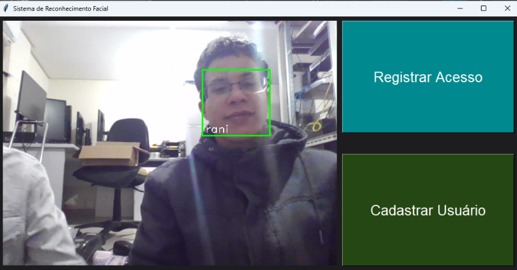
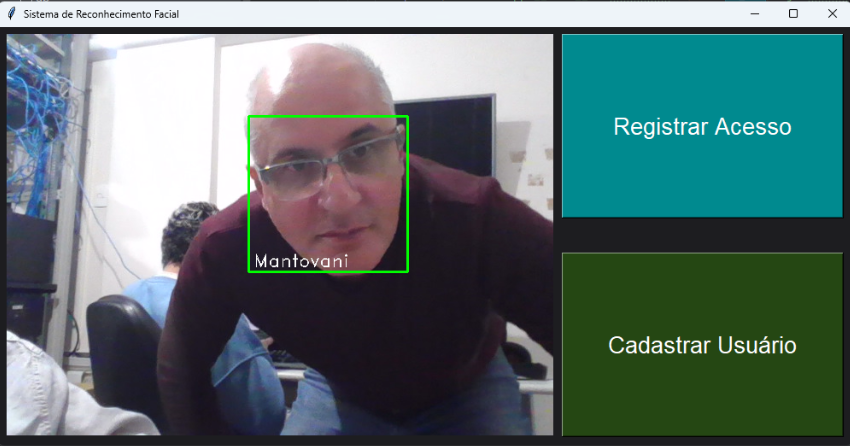

# Sistema de Reconhecimento Facial para Dispositivos Comuns: Prova de Conceito

Este projeto implementa um sistema de reconhecimento facial utilizando bibliotecas de visão computacional e inteligência artificial. Desenvolvido como parte de um Trabalho de Conclusão de Curso (TCC), seu objetivo principal é atuar como uma **prova de conceito para a viabilidade do reconhecimento facial em tempo real utilizando hardware acessível e tecnologias presentes em dispositivos comuns**. O sistema demonstra o potencial da biometria facial como uma solução de **baixo custo** para identificação e autenticação, sem a necessidade de equipamentos especializados.

### Exemplos de Identificação

A seguir, são apresentadas imagens que ilustram a capacidade de identificação do sistema:


*Figura 1: Exemplo de identificação facial para 'Rani'.*


*Figura 2: Exemplo de identificação facial para 'Mantovani'.*

---

## 1. Requisitos do Sistema

Para rodar este projeto, você precisará de:

* **Sistema Operacional:** Windows 10 ou 11 (64 bits).
* **Python:** Versão **3.8.x** (neste projeto foi utilizada a versão 3.8.10).
* **Git:** Para clonar o repositório.
* **Webcam:** Um dispositivo de câmera funcional.
* **Espaço em Disco:** Mínimo de 5 GB livres.
* **Conexão com a Internet:** Necessária para baixar as dependências.

---

## 2. Configuração e Instalação

Siga estes passos para configurar e instalar o ambiente necessário.

### 2.1. Preparação Inicial

1.  **Instale o Python 3.8.10:**
    Baixe e instale o Python 3.8.10 (64 bits) do [site oficial do Python](https://www.python.org/downloads/release/python-3810/). **Importante:** Durante a instalação, **certifique-se de marcar a opção "Add Python 3.8 to PATH"**. Isso é crucial para que o sistema reconheça o Python.
    Você pode verificar a instalação abrindo o Prompt de Comando e digitando `python --version`, que deve retornar `Python 3.8.10`.

2.  **Clone o Repositório:**
    Abra o Prompt de Comando ou PowerShell, navegue até a pasta onde deseja salvar o projeto e clone o repositório:

    ```bash
    git clone [https://github.com/SeuUsuario/Projeto-Final-Sistema-de-Reconhecimento-Facial.git](https://github.com/SeuUsuario/Projeto-Final-Sistema-de-Reconhecimento-Facial.git)
    cd Projet-Final-Sistema-de-Reconhecimento-Facial
    ```
    *(**Atenção:** Certifique-se de substituir `https://github.com/SeuUsuario/Projeto-Final-Sistema-de-Reconhecimento-Facial.git` pela URL exata do seu repositório no GitHub.)*

### 2.2. Configuração do Ambiente Virtual (`venv`)

É altamente recomendado usar um ambiente virtual para isolar as dependências do projeto.

1.  **Crie o `venv`:**
    No diretório raiz do projeto (onde está o `requirements.txt`):
    ```bash
    python -m venv venv
    ```
2.  **Ative o `venv`:**
    ```bash
    .\venv\Scripts\activate
    ```
    Você verá `(venv)` no início do seu prompt, indicando que o ambiente está ativo.

### 2.3. Instalação das Dependências

As dependências do projeto estão listadas no arquivo `requirements.txt`. A instalação do **`dlib`** possui um passo específico e **crucial** devido à sua natureza compilada.

1.  **Instale o `dlib` (PASSO CRÍTICO):**
    A biblioteca `dlib` é um módulo Python para C++ e sua instalação direta via `pip` no Windows pode falhar sem as Build Tools do Visual Studio. Para evitar isso, usaremos uma versão pré-compilada (`.whl`).

    * **a. Baixe o arquivo `.whl`:**
        Baixe o arquivo `dlib-19.22.99-cp38-cp38-win_amd64.whl` de [https://github.com/sachadee/Dlib/blob/main/dlib-19.22.99-cp38-cp38-win_amd64.whl](https://github.com/sachadee/Dlib/blob/main/dlib-19.22.99-cp38-cp38-win_amd64.whl). 
        
        Certifique-se de pegar a versão exata `19.22.99` para `cp38` (Python 3.8) e `win_amd64`.


    * **b. Instale o `.whl`:**
        **Com o `venv` ativo**, execute o comando, substituindo `C:\Caminho\Para\Seu\` pelo local onde você salvou o arquivo:
        ```bash
        pip install C:\Caminho\Para\Seu\dlib-19.22.99-cp38-cp38-win_amd64.whl
        ```

    * **c. Ajuste o `requirements.txt`:**
        **Depois de instalar o `.whl` do `dlib` com sucesso, comente a linha `dlib==19.22.99` no seu `requirements.txt` (adicione um `#` na frente).** Isso impede que o `pip` tente reinstalá-lo ou compilá-lo do PyPI.

2.  **Instale as Demais Dependências:**
    Com o `dlib` instalado, agora você pode instalar o resto das dependências do `requirements.txt` (certifique-se de que a linha do `dlib` está comentada!):
    ```bash
    pip install -r requirements.txt
    ```

---

## 3. Estrutura do Projeto e Preparação de Dados

O projeto é organizado para facilitar a compreensão de suas funcionalidades e o tratamento dos dados.

* **`funcoes_principais.py`**: Este arquivo centraliza a implementação das diversas funções críticas do sistema, como detecção de faces, cálculo de embeddings faciais e comparação de faces. Cada função é cuidadosamente documentada para explicar seu propósito e uso.

* **`serializacao_banco_dados_LFW.py`**: Para otimizar o desempenho do sistema, especialmente no contexto de hardware acessível, este script é responsável por **serializar o banco de dados LFW (Labeled Faces in the Wild)**. Ele processa as imagens do LFW e as converte em um formato otimizado (geralmente um arquivo `.pkl` ou `.json` contendo embeddings faciais pré-calculados). Isso permite o carregamento rápido e eficiente dos dados durante a execução do sistema, evitando o reprocessamento de imagens a cada inicialização e reduzindo a carga computacional.

---

## 4. Execução do Sistema

Após a instalação bem-sucedida, você pode executar o sistema:

1.  **Ative o `venv`** (se ainda não estiver ativo).
2.  **Execute o script `main.py`** do projeto:
    ```bash
    python main.py
    ```

---

## 5. Testes dos Módulos

O projeto inclui um conjunto de scripts de teste para verificar o funcionamento de módulos específicos. Para executar os testes, certifique-se de que seu ambiente virtual esteja ativo e rode os scripts individualmente na raiz do projeto:

* **`test_log.py`**: Testa as funcionalidades de registro de eventos.
* **`test_reconhecimento.py`**: Verifica a capacidade de reconhecimento facial baseada em imagens estáticas.
* **`test_reconhecimento_webcam.py`**: Testa o reconhecimento facial em tempo real via webcam.
* **`test_registro.py`**: Valida as funções de registro de novas faces no sistema.
* **`test_webcam.py`**: Confirma o correto funcionamento e acesso à webcam.

Para rodar um teste específico, use o comando (exemplo para `test_webcam.py`):
```bash
python test_webcam.py